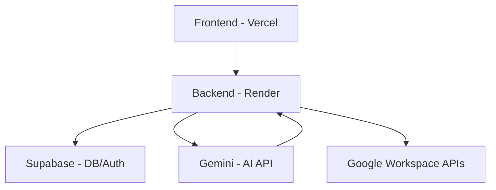

# Architecture

## System Architecture

The Nexus AI system relies on clean boundaries between the following core pieces:
- Frontend (Deployed on Vercel)
- Backend (Deployed on Render)
- Database & Auth (Supabase)
- AI & Tooling (Backend API integrations with Gemini)

## Frontend/Backend Boundary

- The frontend never connects to the database directly for sensitive actions or AI interactions, nor does it hold secrets.
- All Google OAuth tokens and secret keys remain securely on the backend.
- The frontend acts strictly as a UI and state consumer.

## AI Agent

- The AI (Gemini) does NOT have direct DB access.
- It operates via a strict Tool Calling paradigm where it suggests tools, and the backend validates, authorizes, executes, and audits them.

## Tool Registry

- Tools are predefined and strictly registered on the backend.
- Before execution, the inputs are validated and the user's role is checked against the tool's required permissions.

## Workflow Engine

- Workflows are state machines that track entity lifecycles.
- State transitions are performed through defined API endpoints, generating audit logs on each shift.

## Google Integration Layer

- Integrations with Google Workspace (OAuth, Drive, Calendar, Docs, Sheets).
- **Gmail integration uses the direct Gmail API. Make.com is NOT part of the core architecture.**
- The Render backend handles the OAuth callback and persists the refresh token securely in Supabase.

## Database Layer

- Supabase PostgreSQL manages relational data, auth, and audit logging.

## Monitoring

- Every write action and tool execution is audited.

## Deployment

- **Vercel**: Frontend
- **Render**: Backend
- **Supabase**: Database / Auth

