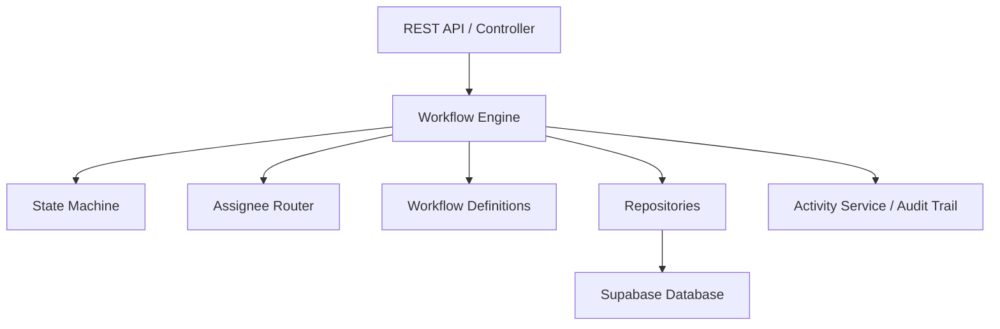

# Core Workflow Engine Architecture

## 1. Overview
The NEXUS AI Core Workflow Engine is a deterministic, non-LLM orchestration layer that powers all enterprise operations flows. It manages state transitions, step advancement, assignee routing, human approvals, task creation, SLA calculations, and permanent activity logging.

## 2. Supported Workflow Types (7 Flows)
1. **`approval`**: Multi-level manager approval and fulfillment processing.
2. **`invoice`**: Vendor invoice audit, finance approval, and payment processing.
3. **`expense`**: Employee expense reimbursement with manager approval and finance payout task.
4. **`procurement`**: Equipment purchase authorization, sourcing task, and fulfillment.
5. **`onboarding`**: Parallel multi-department setup (HR setup, IT provisioning, Manager orientation).
6. **`helpdesk`**: IT ticket assignment, SLA tracking, and resolution.
7. **`meeting`**: MeetingOps post-meeting action items execution and tracking.

## 3. Workflow States & Lifecycle
- `draft`
- `submitted`
- `ai_analyzing`
- `needs_information`
- `awaiting_approval`
- `approved`
- `processing`
- `blocked`
- `escalated`
- `completed` (Terminal)
- `rejected` (Terminal)
- `failed` (Terminal)
- `cancelled` (Terminal)

## 4. Mandatory Business Rules & Security Guardrails
1. **Mandatory Human Approval for Financial Operations:** Money-related workflows (`expense`, `invoice`, `procurement`) MUST NEVER auto-approve. Human sign-off is mandatory.
2. **Self-Approval Prevention:** The requester CANNOT approve their own workflow (`requester_id !== approver_id`).
3. **Role Standardizing:** The IT role is standardized globally as `it_support`.
4. **Permanent Audit Trail:** Every state shift, approval decision, task creation, and task completion creates a timestamped entry in `activity_logs`.
